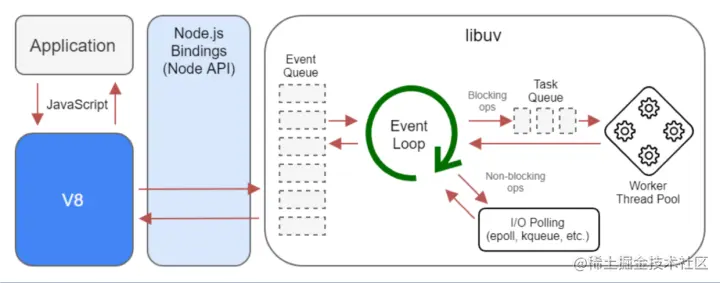

### NodeJs 可以做什么？

当我们忽略网络带宽和硬件性能，影响请求响应速度的最重要因素其实就是 IO 操作时间消耗，在计算机操作中，访问内存数据的时间消耗是纳秒级别的，而磁盘和网络中数据访问的时间消耗则是毫秒级别的，当并发请求数过大时，如果服务器是串行模式，如果当前请求处理中包含一个耗时的 IO 操作的话，那么后续的请求就无法得到及时的响应。传统的服务器处理并发请求时，通常采用多线程或多进程或者消息队列及缓存来解决高并发问题。但这种解决方式还是存在瓶颈。我们不可能无限的增加进程或者线程来解决。nodejs 使用 reactor 模式，结合 JavaScript 事件驱动，异步编程的架构，使 nodejs 远离阻塞，能够更好的利用 cpu 资源。实现高并发请求的处理。但 nodeJs 不适合计算量较大的处理，也就是 cpu 密集型业务。

### 架构

看似是有 ecmascript 和 node api 组成

实际上一下架构

- 应用层为用户编写的业务逻辑代码
- native modules 就是通常所说的 node API 层，由 JavaScript 代码实现，提供了应用程序可直接调用的库，例如 fs、path、http 等。但 js 语言是无法直接操作底层的硬件设备的。所以 node API 如果想要和硬件设备直接通信，需要一个桥梁。
- builtin modules 桥接层，支持 node API 与硬件通信，主要由 c++编写，主要是将底层的模块进行封装编译成可被 js require 的模块文件

- 最底层，通过一些内置模块和第三方模块提供支持。

- cares: 做域名解析
- npm: 包管理工具
- openssl: https 解析

### 异步 IO

对于操作系统，IO 操作分为阻塞和非阻塞两种，也就说是否能够立即返回调用之后的结果。当使用非阻塞 IO 时，cpu 资源就可以继续执行其他事务。此时立即返回的并不是想要得到的业务数据，而是当前的调用状态。操作系统为了得到真正的业务数据，应用程序会重复调用 IO 操作，以确认操作是否完成，这种技术称为轮询。但我们期望调用发起后，直接进行下一个任务处理，然后通过回调的方式来触发

- libuv: 跨平台的异步 IO 工具

  因为各个系统的 I/O 库都不一样，window 系统有 IOCP，linux 有 epoll，nodejs 作者将其整合成了一个跨平台的异步 I/O 库

  什么是 IO
  在硬盘上读写文件
  访问网络、发送数据到其他服务器
  连接打印机等

- v8: js 引擎，为 js 运行体用环境
  将 js 源代码变成机器码
  维护调用栈，确保函数的执行顺序
  内存管理、为所有对象分配内存
  实现 JS 的标准库

异步 IO 无需等待

IO 是操作系统级别。

1、我们代码在 v8 上运行
2、发现需要读一个文件
3、libuv 开一个线程去读文件，读完文件，操作系统返回一个事件给 event loop，event loop 文件传回 v8，触发 js 回调函数。

### 事件驱动

event loop

JavaScript 是单线程的，因为有了 event loop， nodejs 才能非阻塞的执行异步 I/O，大部分操作系统都是多核的，可以在后台执行多个操作，当操作结束，nodejs 会将对应的回调函数放置事件队列，由 event loop 取出对应的回调函数来执行。

在事件循环过程中，事件是有优先级的，所以处理过程也有先后顺序

在浏览器中分为用户响应事件、UI 渲染事件、定时器事件等
在 nodejs 中有异步 IO 事件、服务器事件、定时器事件

事件循环按顺序轮训每种事件

### 单线程

单线程实现高并发。nodejs 底层通过异步 IO、事件循环、事件驱动、通过回调通知来时非阻塞调用，并发。
单线程是指主线程是单线程的，减少线程切换的开销，和内存同步开销，提高线程安全。

处理 CPU 密集型的任务时，无法发挥多核 CPU 的优势。

后续 nodejs 版本通过 cluster 集群方案解决。

### nodeJs 应用场景

很多公司会选择在前端和大后端之间搭建一个 BFF 层

- 用来接收客户端 http 请求
- 格式化数据、渲染 html
- 合并接口请求
- 解决浏览器跨域问题
- 数据缓存

实时聊天程序

### 全局对象

了解了 nodejs 的架构和机制之后，我认为全局对象是一个好的开始

全局对象是一个特殊的对象，可以在程序的任意一个位置访问

可以理解为所有全局变量的宿主

可以类比 alert 之于 window

nodejs 的全局对象是 global

**filename: 返回正在执行脚本文件的绝对路径
**dirname: 返回正在执行脚本的所在目录
timer 类函数

process: 提供与当前进程互动的接口

require: 实现模块的加载

module、exports：处理模块的导出

每个文件都是一个模块，每个文件里的内容都会包裹在一个自调用函数中。

#### process

获取进程信息
  - 进程的cpu、内存消耗
  - 进程工作环境

执行进程操作
  - 监听进程事件

无需 require 即可使用

memoryUse
rss: 常驻内存
heapTotal: 脚本申请总内存大小
heaUsed: 实际使用的内存大小
external: 扩展内存 // 标识c/c++所占据空间大小
arrayBuffers: 独立的空间大小，缓冲区大小

cpuUsage
user 用户占用
system 操作系统占用

path 内置模块

require后直接使用

处理 文件和目录路径

Buffer 缓冲区 以流的形式操作二进制数据 Stream 数据流

fs模块

基本操作类

实例方法

任何一种方法都存在同步和异步操作两种方式

### 模块化历程

模块作用

命名冲突和污染

代码冗余

文件依赖关系复杂

commonjs规范，模块加载是同步完成的
不适用浏览器平台

ES modules规范

当下常用的是commonjs 和 esm

commonjs是语言层面的规范，模块化只是其一个部分

模块引用

模块定义

模块标识

nodejs中任意一个文件就是一个模块，具有独立作用域
使用require导入其他模块
将模块ID传入require实现目标模块定位

任意一个文件就是一个模块，可以直接使用module属性

id: 模块标识符，一般是一个绝对路径
filename：返回文件模块的绝对路径
loaded: 返回布尔值，表示模块是否加载完成
children: 返回数组，存放当前模块调用的其他模块
exports: 返回当前模块需要暴露的内容
paths：返回数组，存放当前不同目录下的node_modules位置

module.exports 和 exports 的区别
两者执行同一个内存地址

require属性
基本功能室读入并且执行一个模块文件，然后返回返回模块文件的exports对象

resolve： 返回模块文件绝对路径
extensions: 依据不同后缀名执行解析操作 .js .json
main: 返回主模块对象

使用module.exports 与 require 实现模块导入和导出
module属性及常见信息
exports导出数据及其与module.exports 区别
同步载入

核心模块在node运行那一刻就以二进制的形式加载到内存中了
